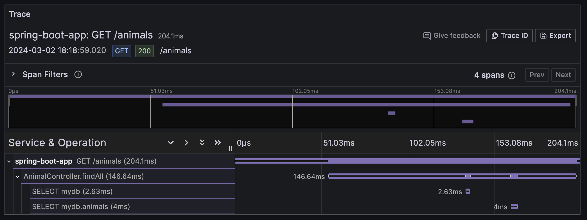
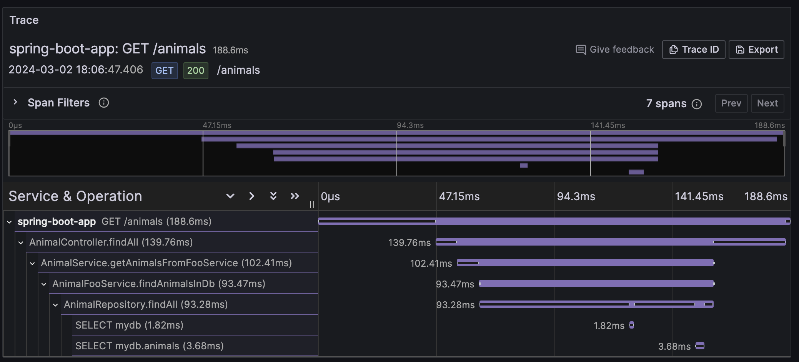

# spring-otel-extended - Extending Springs instrumentation
This repository provides multiple approaches to (auto)-instrument Spring and Spring Boot using the OpenTelemetry java agent and -Instrumentation.

This is a Work in Progress for now. For current TODOs, see [TODOS](#todo) 
## Use Case
At the time of writing this, when you use the OpenTelemetry Java Agent to auto-instrument a Spring-Application, your traces look like in the following picture:

This is a fine Trace, but there might be something missing in the "in between", and especially for bigger (often: over-abstracted / over-architected legacy) apps, such a trace can be very hard to read, because it usually consists of way more database calls, so you have one /GET call and then, say, 10s of DB calls, and then another POST call to a downstream service... and so on.

The idea here is to show the intermediate, Spring-annotated steps like in the following picture:

This is actually the same operation that was done in the first picture, but now we see the chain of callers, so it is possible to really understand what part of your app did the database calls.

I know that this leads to the generation of many spans and is therefore not added to the official auto-instrumentation, see the [the otel issue](https://github.com/open-telemetry/opentelemetry-java-instrumentation/issues/2574). So, it might not be suitable in production telemetry, but it certainly helped me a lot to understand the inner workings of unknown/legacy spring and spring boot codebases, where those traces consist of 30+ spans, lots of them looking like random database queries. 

Alternatively, one could surely use tools like the great [Grafana Pyroscope](https://github.com/grafana/pyroscope) continuous profiling tool to achieve the same, but the solutions shown in this repository feel more lightweight to me, as I simply do not need to spin up and maintain another component and integrate another agent to achieve a more high-resolution look into the application.

## Overview

This repository consists of 5 services:
1) `official-auto-otel-animal-app`: A Spring Boot-Application with an example structure using `@Component`,`@Service` and `@Repository`.
2) `aspect-based-otel-animal-app`: The same App as 1), but using Springs AOP to add Spans to all public methods for the intermediate Layers.
3) `otel-javaagent-spring-extension`: An OpenTelemetry Java-Agent [Extension](https://opentelemetry.io/docs/languages/java/automatic/extensions/) that extends the official agent capabilities to record the intermediate spans.
4) `extension-based-otel-animal-app`: An app that uses the Java agent extension from 3) to provide the same functionality as the aspect solution, without "touching the code".
5) `legacy-tomcat-spring-app`: (WIP, not working) - The same applictaion, but  running on a legacy spring 5 stack (plain, without spring boot) to check if it works on application servers (tomcat9, jdk11)

## Packaging 
The Observability-Stack consists of: 
* The apps, packaged as containers
* An OpenTelemetry Collector where the signals are sent to
* Prometheus for metrics 
* Tempo for Traces
* Grafana for visualization
It is built using containers and compose for the sake of simplicity. It is tested using docker. I am happy to hear if it also works for podman and other container solutions.

## Running the stack

First, build the respective modules using e.g. `mvn clean package` in each of the 4 modules (see [TODO](#todo))

You can start the stack simply by running `docker compose up --build -d` from the root directory of this repository. 

The following endpoints are available when the stack is started:
* `official-auto-otel-animal-app`: Call [http://localhost:8081/animals](http://localhost:8081/animals) 
* `aspect-based-otel-animal-app`: Call [http://localhost:8082/animals](http://localhost:8082/animals)
* `extension-based-otel-animal-app`: Call [http://localhost:8083/animals](http://localhost:8083/animals)
* `legacy-tomcat-spring-app`: Call [http://localhost:8084/animals](http://localhost:8083/animals)
* `Grafana`: Call `http://localhost:3001` to access the dashboard. Prometheus and Tempo data sources are already added. Username and Password: `admin // pass`

To stop the stack, call `docker compose down`. 

If you want to delete the existing data, use `docker compose down -v` to delete the named volumes.

## TODO
- Add Spring legacy example 
- use gradle / maven multi-module to make building the apps more convenient (contribution welcome)

# DONE
- Get the custom java agent extension for complemental spring spans to work. 🥳
